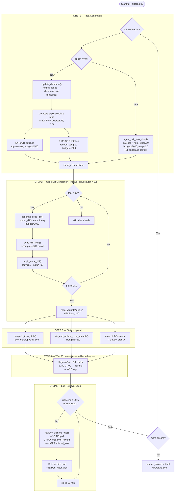

# Automated AI Researcher — Workflow Diagram

> Generated from `docs/workflow_detailed.md`

## Key Design Points

| Aspect | Detail |
|---|---|
| **Parallelism** | 10 threads generate code diffs simultaneously |
| **Self-correction** | Up to 10 retry trials per diff, feeding error back to LLM |
| **Exploit/Explore** | Ratio starts 50/50 at epoch 1, ramps to 80/20 by epoch 8 |
| **Polling guard** | Only stops waiting once ≥30% of submitted ideas return W&B logs |
| **External boundary** | GPU scheduling (HuggingFace + B200 workers) is entirely outside the repo |
